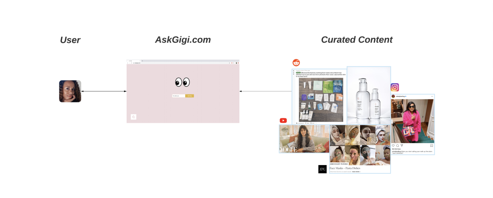

# **Project:** Ask Gigi
Author: [Dina A. Bahar](https://www.linkedin.com/in/dinabahar/)

## I. Business Goals and Problem Statement

Ask Gigi is one of Glossier's new tech initiative this year. It is an interactive chat room for the Glossier community to come and ask anything beauty-related, like a modern day advice column. The value proposition is to *eventually* curate content for each user based on the user's skin concerns and beauty interests that we can pick up from their chat with *Gigi*. The following are KPI's for Ask Gigi:
- Lead generation
- Website traffic
- User data

Before we can make all of that happen, the **Ask Gigi beta** will be a simple chat room that will recommend users a subreddit that they might enjoy. Skincare Reddit has been dubbed by [Cosmopolitan](https://www.cosmopolitan.com/style-beauty/beauty/a29429580/reddit-skincareaddiction/) as a place where people can not only access years of digestible, science-backed information, but also receive support from a tight knit, active community. Which makes for the perfect recommendation for Ask Gigi beta. 

The two biggest skincare subreddits are [r/SkincareAddiction](https://www.reddit.com/r/SkincareAddiction/) and [r/AsianBeauty](https://www.reddit.com/r/AsianBeauty/). You will see in our EDA that r/SkincareAddiction frequently discuss topics that we already address with our current skincare and beauty [products](https://www.glossier.c`om/products/) and often cover on [Into The Gloss](https://intothegloss.com/). Hence, with the first iteration of Ask Gigi, we want to recommend users to r/AsianBeauty whenever appropriate because the subreddit covers broad topics, concerns and interests, that we often do not. Besides an opportunity to outsource content beyond our scope, this also expands our market reach. 

To evaluate our success, we are tracking user engagement on Reddit with the following KPI's:
- Bounce rate
- Time spent

A low bounce rate and long time spent on r/AsianBeauty indicates that our user find value in our predicted outcome (recommendation). This success will be the building block for the G-team to improve and scale Ask Gigi. Therefore, the Data Science problem is,

>Can we use NLP and logistic regression classifier to predict if r/AsianBeauty has better answers to a user’s beauty concerns?

## II. Data Dictionary

We are using Pushshift's API to collect Reddit posts, please find the data dictionary [here](https://github.com/pushshift/api#search-parameters-for-submissions).

## III. Findings

#### Most Frequent Keywords

For the initiative, I scraped r/AsianBeauty and r/SkincareAddiction using Pushshift's API. The venn diagram above summarized the most frequent words in the two subreddits. Words that often come up in each subreddit implies the most popular topics--market needs and/or trends--covered in the forum.

We see that there are overlapping topics, as well as differentiating keywords such as 'essences', 'sheet mask', and 'snail' from r/AsianBeauty and 'moisturizer', 'sensitive', niacinamide', and 'vitamin (C)' from r/SkincareAddiction.

The reason why we are trying to recommend users r/AsianBeauty is because it covers broad topics that aren't in our domain. As mentioned before, r/SkincareAddiction covers topics that Glossier already address, be it on Into The Gloss or through our own product line as illustrated above. Hence, besides an opportunity to be innovative in serving our Glossier community, this beta version of Ask Gigi is also an opportunity for us to expand and serve a new market.

#### Statistically Significant Overlapping Common Words
More, I did a hypothesis test to see if overlapping common words have statistically significant difference in mean of frequency. Below is a bar chart showing the statistically significant keywords that might be useful in predicting if a post is coming from r/AsianBeauty or otherwise. The direction of the T-tests indicates which subreddit the word might serve as a useful predictor: negative T-tests are words that signify r/SkincareAddiction and positive T-tests are words that signify r/AsianBeauty.

#### Summary of Findings
Besides the differentiating keywords (not overlapping keywords), the statistically significant overlapping common words implies that each subreddit discusses certain topics more often than the other. Below is a summary:

| Subreddit         | Topics of Discussion                                             |
|-------------------|------------------------------------------------------------------|
| AsianBeauty       | Oily (skin), acids, serums, gels, toners                         |
| SkincareAddiction | Makeup, acne, dry (skin), sunscreen, (face) oils, AM/PM regimens |

## IV. Modeling
I compared a Logistic Regression to a Bernoulli Naive Bayes. See how the accuracy scores compare below:

|       | Baseline | Logistic Regression | Bernoulli Naive Bayes |
|-------|----------|---------------------|-----------------------|
|       | 50.3%    |                     |                       |
| Train |          | 99.9%               | 90.8%                 |
| Test  |          | 88.3%               | 65.6%                 |

More, to answer the problem at hand, the Logistic Regression Classifier with the following parameters performed best on unseen data:

- `penalty` of l2 (ridge regularization)
- `ngram_range` of word pairs (2,2)
- custom stopwords
- `cv` of 5 folds

I evaluated the model with the following metrics:

#### Accuracy Scores

The differing accuracy scores are evidence that this model is overfit. However, it is still correctly predicting approx. 90% of unseen data.

We can use this model in production given it's chance of misclassifying is only around 10% of the time. Additionally, the risk of misclassification is low since there are a lot of overlapping topics in the two subreddits. A user might still find value in either subreddit.

#### Confusion Matrix

When we look at the test data confusion matrix heatmap above, the model is slightly better at predicting True Negatives (yellow box) than True Positives (green box). Ideally, we want to have a fairly even split between correct predictions given our effort to balance our classes. However, we used a list of custom stopwords to avoid training our model with keywords that are invaluable. In this case, words that might be too specific and unlikely to be mentioned by users. This explains the slight imbalance in our confusion matrix. 

This trade off between predicatbility and interpretability is neccessary to have a working model that generalizes well and serve the goal of Ask Gigi.

#### Coefficient Weights

If a feature has a coefficient weight of 10, all else held constant, a 1 unit increase in the feature means a 10x increase in odds that the observation is of class $y$ = 1. However, if a feature with 0 weight means, a 1 unit increase in the feature does not change the odds of an observation being $y$ = 1. In other words, the strongest coefficient weights indicates which keywords are better at predicting if a post comes from r/AsianBeauty.

 

By looking at word pairs instead of a word on its own, I gain more context to the topics covered in the subreddit. 

While most of the words in the top 20 coefficient weights were implied in EDA (e.g. sheet masks, snail, and cosrx), the more interesting finds are mentions of sunscreen, dry (skin), and plastic surgery. I expected the first two topics--sunscreen and dry (skin)--to have low coefficient weights
since they actually showed up in the r/SkincareAddiction more often in EDA. Further, the word pair, 'plastic surgery,' never showed up in EDA because we scrutinized words on their on instead of word pairs.

All in all, these words with strong coefficient weights are both generic and specific enough that would come up as concerns or questions brought up by users on Ask Gigi.

## V. Conclusion & Recommendations

So, can we use NLP and logistic regression classifier to predict if r/AsianBeauty has better answers to a user’s beauty concerns?

Yes. If a user mentioned concerns, keywords, with strong coefficient weights, Ask Gigi will reckon that the user will find better answers in r/AsianBeauty with approx. 90% accuracy.

I recommend using the Logistic Regression model for the production of Ask Gigi beta, so we can start user-testing.

## VI. Next Steps
1. Fine tuning keywords and stopwords to improve model accuracy.
2. Monitor KPI and model performance at first.
3. Build a model to see which topics are best covered by r/SkincareAddiction.
4. UAT questions:
    a. Is there mention of the key words at all? Adjust model accordingly.
    b. Are users satisfied with the recommendation?
5. Explore other subreddits and mediums to recommend to users, scale Ask Gigi.